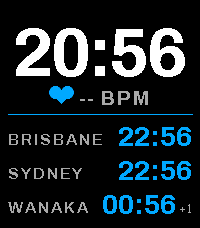
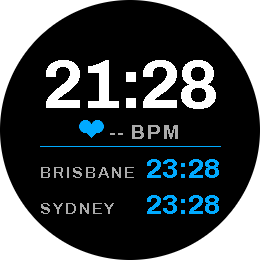
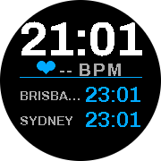
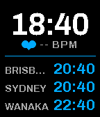
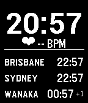

# Travel Time — Pebble Time 2 watchface

A world-clock watchface for the **Pebble Time 2** (and other Pebble models).

- A large clock always shows your **current location** time (the device's local
  time, which on modern PebbleOS tracks your phone's timezone).
- Add as many **other cities** as you like from the phone settings page; they
  appear in a smaller list beneath the main clock, each with a `+1` / `-1` day
  marker when their calendar date differs from yours.
- If an added city happens to be in **your current timezone**, it's a duplicate
  of the big clock, so it's **automatically hidden**.
- A **heart icon + current BPM** is shown below the date (uses the Pebble Time 2
  heart-rate sensor; shows `--` until a reading is available).

## Screenshots

<table>
  <tr>
    <td align="center"><br><sub><b>emery</b><br>Pebble Time 2</sub></td>
    <td align="center"><br><sub><b>gabbro</b><br>Pebble (round, colour)</sub></td>
    <td align="center"><br><sub><b>chalk</b><br>Pebble Time Round</sub></td>
  </tr>
  <tr>
    <td align="center"><br><sub><b>basalt</b><br>Pebble Time / Steel</sub></td>
    <td align="center"><br><sub><b>aplite</b><br>Pebble / Pebble Steel</sub></td>
    <td align="center"><br><sub><b>diorite</b><br>Pebble 2</sub></td>
  </tr>
</table>

## How it works

| Piece | Role |
|-------|------|
| `src/c/main.c` | Renders the face. Big clock uses `localtime()`; each city is `gmtime(now + offset)`. Computes the device's own UTC offset to detect & hide duplicates. Reads heart rate via `HealthMetricHeartRateBPM`. Persists the city list so the face is correct before the phone connects. |
| `src/pkjs/index.js` | PebbleKit JS. Hosts the settings page, computes each city's **current** UTC offset (DST-aware, via `Intl.DateTimeFormat`), and sends names + offsets to the watch over `AppMessage`. |
| `package.json` | App manifest. Targets `emery` (Pebble Time 2, 200×228 colour) plus the other platforms. Declares the `messageKeys`. |

City offsets are recomputed by the phone every time the watchface launches
(the `ready` event) and whenever you change the city selection, so DST changes
are picked up automatically.

## Settings

Open the Pebble mobile app → the watchface → **Settings**. Tick the cities you
want and tap **Save**. The list defaults to New York / London / Tokyo on first
run. The settings page is fully self-contained (served as a `data:` URI) — no
web hosting required.

## Building

Requires the Pebble SDK / `pebble` CLI from Core Devices
(<https://developer.repebble.com>).

```sh
# from this directory
pebble build

# run in the Pebble Time 2 emulator
pebble install --emulator emery --logs

# or install to a physical watch over the phone
pebble install --phone <PHONE_IP> --logs
```

The compiled `build/PebbleTravelTime.pbw` (named after the project directory)
can also be side-loaded via the mobile app.

## Releasing & publishing

Two GitHub Actions workflows in `.github/workflows/` drive this. CI installs the
Pebble SDK and runs `pebble build` for you, so you don't need a local toolchain
to cut a release.

- **`build.yml`** — builds the `.pbw` on every push/PR; on a `v*` tag it also
  attaches the binary to a GitHub Release. No secrets required.
- **`publish.yml`** — manual trigger; builds and uploads to the Core Devices
  (repebble) appstore via `pebble publish`. Requires the one-time token setup
  in [Publishing to the repebble appstore](#publishing-to-the-repebble-appstore).

### 1. Cut a version (build + GitHub Release)

1. Bump `version` in `package.json` (e.g. `1.0.0` → `1.1.0`) and commit it.
2. Tag the commit and push the tag:
   ```sh
   git tag v1.1.0      # match the package.json version
   git push origin main --tags
   ```
3. `build.yml` runs automatically: it builds and attaches `build/*.pbw`
   (i.e. `PebbleTravelTime.pbw`) to a **GitHub Release** for that tag. The
   binary is also available as a run **artifact** on every push, tag or not.

### 2. Publish to the repebble appstore

Pick whichever you prefer:

**A. From CI (recommended once set up).** Actions tab → *Publish to Pebble
appstore* → *Run workflow* → enter a description. It builds and runs
`pebble publish` using your stored token. Requires the one-time setup below.

**B. From your machine.** With the Pebble CLI installed and logged in:
```sh
pebble build
pebble publish --description "What changed in this release"
```

Either way, the **first** publish creates the appstore listing (title comes from
`package.json` `displayName`); later publishes add a new release under the same
UUID. Listing copy, screenshots, and store metadata live in
[`store/LISTING.md`](store/LISTING.md).

#### Publishing to the repebble appstore

For **option A** the appstore uses Firebase auth, so the workflow needs a
long-lived credential. Generate it once on your machine:

```sh
pebble login   # opens browser; use the same account as the developer dashboard
```

This caches credentials at `<persist-dir>/oauth_firebase/firebase_oauth_storage.json`,
where `<persist-dir>` is `~/.pebble-sdk` if it exists, otherwise
`$XDG_DATA_HOME/pebble-sdk` (defaults to `~/.local/share/pebble-sdk`); on macOS
it's `~/Library/Application Support/Pebble SDK`. Pull the refresh token out:

```sh
python3 -c "import json,glob;print(json.load(open(glob.glob('$HOME/.local/share/pebble-sdk/oauth_firebase/firebase_oauth_storage.json')[0]))['refresh_token'])"
```

Copy that `refresh_token` value into a GitHub Actions secret named
`PEBBLE_FIREBASE_REFRESH_TOKEN` (Settings → Secrets and variables → Actions).
The workflow exchanges it for a short-lived `id_token` on each run. The refresh
token grants full publish access to your account — treat it like a password,
and consider gating `publish.yml` behind a protected environment with required
reviewers (there's a commented-out `environment:` line ready for it).

## Notes / possible extensions

- Cities are shown in the order they appear in the master list. Drag-to-reorder
  could be added to the settings page.
- The master city list (`CITIES` in `index.js`) is easy to extend — each entry
  is just an IANA timezone plus a fixed-offset fallback.
- `MAX_CITIES` (in `main.c`) caps the list at 10; the screen fits ~5 rows on
  `emery`, fewer on smaller models.
